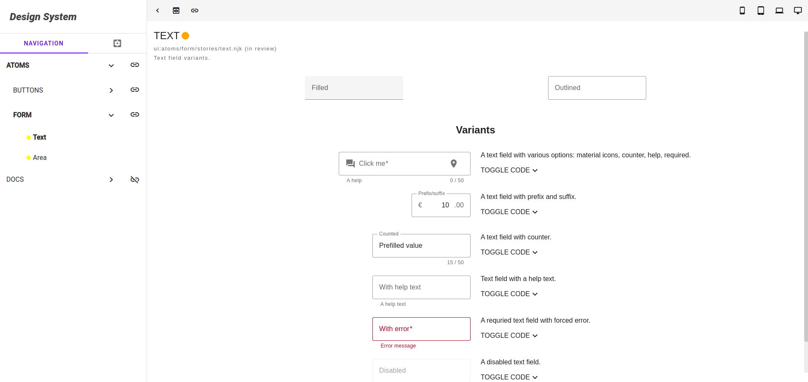

# What?

It's yet another design system but experimental and built for Nunjucks components, working on top of the awesome [Apostrophe](https://apostrophecms.com/) (version 3 alpha).

## Development / Demo install

Clone this.

Be sure you have mongodb running. If you don't but you have `docker-compose` installed - we got your back! Just do:
```sh
docker-compose up -d
```
It'll take a while but only the first time. Promise.

When your mongodb is up and running:
```sh
npm i
```
It may take a while...

When you are ready playing stop your mongo:
```sh
docker-compose down
```

Your database will be saved no matter that. If you want to completely remove it:
```sh
docker volume ls
```

You should see `apos-ds_mongodb-data` (or similar if you cloned in different than the default folder).
Execute `docker volume rm apos-ds_mongodb-data` to remove it.

## Run it

The demo app `packages/app` is slightly modified [Apostrophe 3 boilerplate](https://github.com/apostrophecms/a3-boilerplate).
In order to be able to add page and attach the design system to it, you have to create user:
```sh
cd packages/app && node app @apostrophecms/user:add admin admin
```

From the project root or inside `packages/app` run:
```sh
npm run dev
```

Some instructions are available on the initial home page. Log in and create new page with type `Design System`.

## Where are the docs?

On the way!

## Where is the npm package?

`npm i @corllete/apos-ds`

[The full story](packages/apos-ds)

## A quick look


